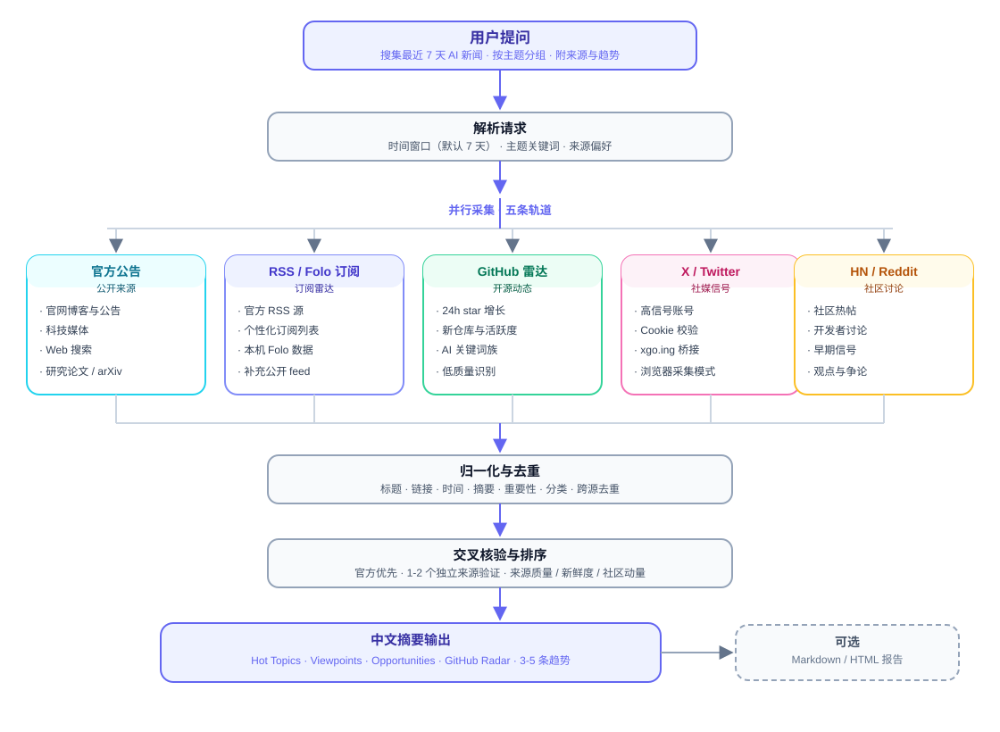
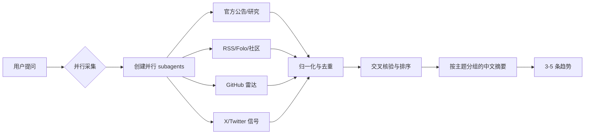

<div align="center">


# AI News Search

**最近 7 天 AI 新闻雷达 · 多源采集 · 交叉核验 · 一键出报告**

一个面向 Codex / Claude 等 Agent 的 AI 新闻检索 Skill：将官方公告、RSS/Folo 订阅、GitHub 热门仓库、X/Twitter 与 HN/Reddit 拆分给多个子代理并行采集，归一化去重后生成带来源链接、按主题分组的中文摘要，并给出 3-5 条值得关注的趋势。

[](LICENSE)
[]()
[]()
[]()
[]()

</div>

---

## ✨ 特性

- **多子代理并行采集**：按信源拆分官方/研究、RSS·社区、GitHub、X/Twitter 等 worker，互不阻塞，最后由主代理合并交叉核验
- **自适应并发**：根据当前可用的 subagent 槽位创建 2-4 个 worker；单一信源的小问题则直接搜索
- **视频创作工作流**：通过 `ai-news-video` 将新闻简报转换为 9:16 PPT 信息卡、中文旁白、字幕和可审核 MP4
- **默认 7 天窗口**：优先覆盖过去 24 小时的重要进展，时间窗口可随用户需求调整
- **结构化输出**：Hot Topics · Viewpoints · Opportunities · GitHub Radar · 一页纸摘要，每条含来源链接、发布时间、重要性说明
- **中文友好**：默认按主题分组输出中文摘要，末尾附 3-5 条趋势
- **真实本地数据**：X 高信号账号与 RSS 源可直接从本机 Folo 订阅库导出，X 内容经 xgo.ing 桥接拉取（无需 cookie 也可读公开账号）
- **开箱即用的脚本**：GitHub 热门仓库、X Cookie 管理、报告生成等 10 个助手脚本

---

## 🧭 工作流程

<p align="center">
  
</p>

<details>
<summary>交互式 Mermaid 版本（GitHub 支持缩放）</summary>



</details>

> 多个 worker 并行执行，主代理统一等待、合并、去重、交叉核验和排序；没有足够并发槽位时自动减少 worker 数量。

---

## 🚀 快速开始

### 方式一：作为 Codex Skill 安装

```bash
# 1. 克隆仓库
git clone https://github.com/tallate/ai_news_search.git

# 2. 安装到 Codex skills 目录
mkdir -p ~/.codex/skills
cp -R ai_news_search/ai-news-search ~/.codex/skills/

# 3. 直接对话使用
> 帮我搜集今天最新的 AI 新闻，按主题分组，给出来源和趋势
```

### 方式二：作为独立工具使用

```bash
cd ai-news-search

# GitHub 热门 AI 仓库雷达（近 7 天新建、按 star 排序）
python3 scripts/github_hot_ai_repos.py

# GitHub 快速上升仓库（24h 活跃度优先）
python3 scripts/github_trending_fast_risers.py --hours 24

# 构建 X 搜索查询（默认最近 2 天）
python3 scripts/prepare_X_search.py --keywords "agent,MCP" --days 2 --open
```

---

## 📖 使用示例

### 生成一份中文新闻摘要

```text
使用 ai-news-search skill 搜集最近 24 小时内的重要 AI 新闻，
包含模型/产品发布、公司动态、研究论文、开源项目、政策监管和行业应用。
输出中文摘要，按主题分组，给出每条新闻的来源链接、发布时间和重要性。
```

### 一键生成 HTML 报告

```bash
# 收集到的条目先归一化成 items.json
python3 ai-news-search/scripts/generate_report.py items.json report.md
python3 ai-news-search/scripts/generate_report.py items.json report.html --html
```

### 生成带旁白的新闻卡片视频

将 `ai-news-search` 输出的结构化新闻交给 `ai-news-video`，生成可编辑 PPTX、渲染卡片、旁白音频、字幕和竖屏 MP4。默认只生成审核包，不自动发布：

```text
使用 ai-news-video，将这份 AI 新闻简报制作成 45-90 秒的中文竖屏视频。
先生成 9:16 PPT 信息卡片，再渲染成图片，生成旁白和字幕，最后合成 MP4。
输出 slides.pptx、narration.mp3、subtitles.srt、video.mp4 和 publish.md。
```

### X / Folo 采集准备

```bash
# 校验并刷新 X cookies（首次会打开浏览器引导登录）
./ai-news-search/scripts/ensure_X_cookies.sh

# 验证 cookie 文件
python3 ai-news-search/scripts/validate_X_cookies.py
```

---

## 📁 项目结构

```text
ai_news_search/
├── README.md                        # 本首页
├── LICENSE                          # MIT
├── .gitignore
└── ai-news-search/                  # Skill 主目录
    ├── SKILL.md                     # Skill 主文件（完整工作流与规则）
    ├── assets/
    │   ├── logo.svg                 # 项目 Logo
    │   └── flowchart.svg            # 执行流程图
    ├── references/
    │   ├── ai-radar-sources.md      # 官方源 + 本机 Folo 观测到的 RSS 源
    │   ├── x-high-signal-accounts.txt  # 高信号 X 账号清单（Folo 导出）
    │   └── github-hot-repos.md      # GitHub 雷达关键词、排序与核验规则
    ├── scripts/
    │   ├── export_folo_subscriptions.py  # Folo 订阅导出（占位，可升级为真实导出）
    │   ├── export_X_cookies.py           # 从 Chrome/Edge 导出 X cookies（macOS）
    │   ├── validate_X_cookies.py         # 校验 cookie 文件
    │   ├── ensure_X_cookies.sh           # 校验 → 登录(CDP) → 导出 → 再校验
    │   ├── open_X_login_cdp.sh           # CDP 方式打开 X 登录
    │   ├── prepare_X_search.py           # 生成 X 搜索查询
    │   ├── github_hot_ai_repos.py        # GitHub 搜索 API 雷达
    │   ├── github_trending_fast_risers.py # 24h 快速上升仓库
    │   ├── generate_report.py            # Markdown/HTML 报告生成
    │   ├── template.md                   # 一页纸摘要模板
    │   └── template.html                 # HTML 报告模板
    └── README.html                   # 备用 HTML 版项目说明（可选）
```

视频创作 skill 位于：

```text
ai-news-video/
├── SKILL.md                          # PPT → 旁白 → 字幕 → MP4 工作流
└── agents/openai.yaml                # Skill UI 元数据
```

---

## 🧩 模块说明

### References（数据底座）

| 文件 | 内容 |
| --- | --- |
| `ai-news-search/references/ai-radar-sources.md` | 官方公告源、补充 RSS、本机 Folo 中观测到的真实 feed |
| `ai-news-search/references/x-high-signal-accounts.txt` | 100+ 高信号 X 账号，按官方 → 核心人物 → 社区排序 |
| `ai-news-search/references/github-hot-repos.md` | GitHub 雷达的关键词族、24h 排序规则、低质量识别 |

### Scripts（采集与报告工具）

| 脚本 | 作用 |
| --- | --- |
| `scripts/github_hot_ai_repos.py` | 关键词扫 GitHub 搜索 API，返回近 7 天热门 AI 仓库 |
| `scripts/github_trending_fast_risers.py` | 24h 活跃度优先的快速上升仓库，含 trending 页兜底 |
| `scripts/prepare_X_search.py` | 把关键词/账号转成 X 搜索链接，可一键打开 |
| `scripts/ensure_X_cookies.sh` | X 采集前置：自动校验、登录、导出 cookie |
| `scripts/generate_report.py` | 把归一化 JSON 渲染成 Markdown / HTML 报告 |
| `scripts/template.md` / `template.html` | 一页纸报告模板 |

---

## 🔐 关于 X / Folo 采集

- X 内容优先走 **xgo.ing RSS 桥接**：公开账号无需登录即可读取，已验证可返回真实推文流
- 需要完整时间线时使用 **X cookies**（`x_cookies.json`），脚本支持从 Chrome/Edge 一键导出并在失效时自动刷新
- Folo 订阅列表可通过三种方式获取：官方 API `api.follow.is/subscriptions/export`（需登录）、App 内导出备份（xml）、或解析本地 IndexedDB
- **Cookie 文件切勿提交到仓库**（已在 `.gitignore` 中排除）

---

## ❓ FAQ

**Q: 这个 Skill 只能用在 Codex 里吗？**

A: 不。SKILL.md 是给 Agent 的指令集，但 scripts/ 都是独立可用的命令行工具；Claude Code、Cursor 等支持 Skill 的 Agent 也可以套用。

**Q: 数据来源可靠吗？**

A: 采集只是第一步，输出前会做交叉核验：重要结论至少需要 1-2 个独立来源支撑，不把未经证实的信息当事实输出。

**Q: 为什么 reference 里有“本机 Folo 观测”数据？**

A: 这些是从作者本机 Folo 订阅库导出的真实订阅（X 账号 + RSS 源），作为个性化雷达的种子数据；你可以随时替换成自己的订阅。

---

## 🗺️ Roadmap

- [x] 五轨并行采集与合并交叉核验
- [x] GitHub 雷达（24h 排序 + 兜底）
- [x] X 采集（cookie 管理 + 桥接）
- [x] Markdown/HTML 报告生成
- [ ] `export_folo_subscriptions.py` 升级为真实读取本地 Folo IndexedDB
- [ ] 支持 RSSHub 全局路由解析，扩大订阅源覆盖
- [ ] 支持定时任务：每天固定时间自动生成早报
- [ ] 多云盘/邮件自动推送

---

## 🤝 贡献

欢迎提交 Issue 和 PR：

1. Fork 本仓库
2. 新建分支 `feat/xxx` 或 `fix/xxx`
3. 提交变更并补充测试/说明
4. 发起 Pull Request

---

## 📄 License

[MIT](LICENSE) © 2026 last_7_days_news contributors
